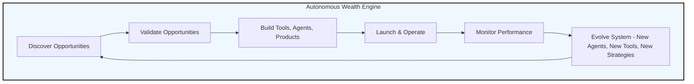

# 🔄 AWE System Lifecycle

```mermaid
flowchart TB
    subgraph AWE [Autonomous Wealth Engine]
        D[Discover Opportunities] --> V[Validate Opportunities]
        V --> B[Build Tools, Agents, Products]
        B --> L[Launch & Operate]
        L --> M[Monitor Performance]
        M --> E[Evolve System - New Agents, New Tools, New Strategies]
        E --> D
    end
    style AWE fill:#f0f8ff,stroke:#000,stroke-width:2px
```

This flow defines AWE's core intelligence loop.